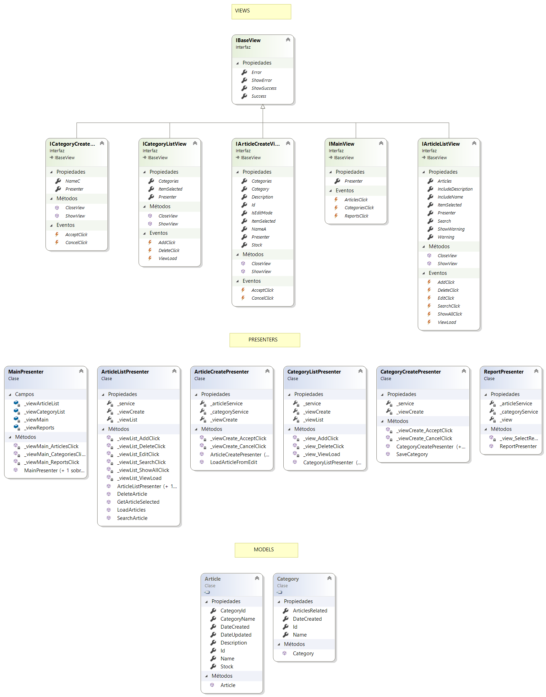
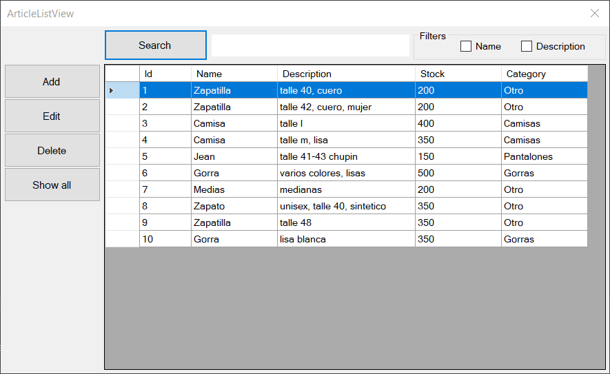
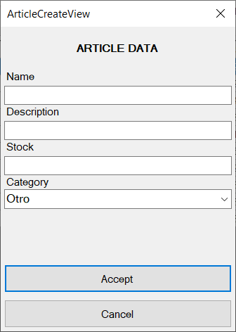
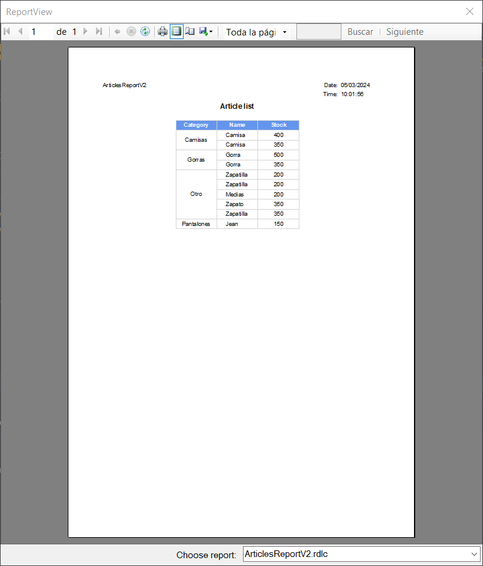
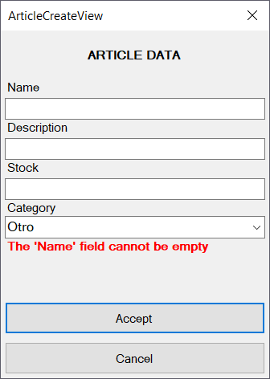
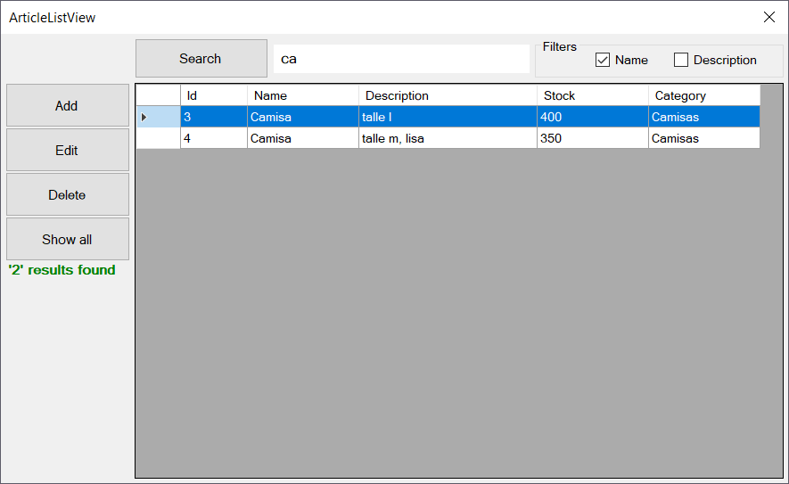

# Crud MVP WinForms

Aplicación tipo CRUD hecha en WinForms utilizando el patrón MVP (Modelo-Vista-Presentador)

## Descripción general

Este proyecto consiste en una pequeña aplicación de escritorio hecha en C# .Net Framework 4.5 
y base de datos SQL Server o SQLite.

**NOTA**: El proveedor de base de datos es configurable desde el archivo `App.config`.

## Características

* Creación, edición y borrado de items (artículos y categorias).
* Módulo de reportes.

## Requisitos previos

* [Runtime de .Net Framework 4.5](https://www.microsoft.com/es-ar/download/details.aspx?id=42642)
* [SQL Server 2017/2019](https://www.microsoft.com/es-ar/download/details.aspx?id=101064) (si se elige como proveedor de base de datos)
* [Microsoft SQL Server Managment Studio (SSMS)](https://learn.microsoft.com/es-es/ssms/install/install) (opcional)

**NOTA**: Esta aplicación funciona únicamente sobre sistemas operativos Windows.

## Instalación

1. Descargar la última versión del proyecto [desde aquí](https://github.com/manuel-chinchi/crud-mvp-winforms/releases) 
y descomprimir en algún directorio.
2. Si se elige proveedor de base de datos SQLite saltar al paso 4 directamente.
3. Abrir el script `db_squema_and_data.min.sql` desde SSMS y ejecutarlo.
4. Abrir el archivo `crud-mvp-winforms.exe.config` y configurar la cadena de conexión.
    En caso de que 
5. Ejecutar el archivo `crud-mvp-winforms.exe` e interactuar con la aplicación.

Eso es todo.

<!-- 
**ADICIONAL**

*Si quiere probar la aplicación solamente sin tener que crear o configurar una
base de datos SQL Server puede descargar [desde aquí](https://github.com/manuel-chinchi/crud-mvp-winforms/releases/tag/v1.0.1) una versión portable
que usa SQLite.*
-->

## Arquitectura de la aplicación

Esta aplicación cuenta con una estructura tipo Modelo-Vista-Presentador (MVP) 
en la cual los presentadores conectan los modelos a las vistas mediante 
los contratos correspondientes, en los presentadores se maneja toda la lógica
de aplicación. 
Ademá, la aplicación se encuentra separada en cinco capas (proyectos) para su mejor organización.
 
 - **EntityLayer**: La capa que contiene los modelos de datos.
 - **DataLayer**: Es la capa de acceso a datos, contiene los repositorios y la configuración
 de la conexión a la base de datos.
 - **BussinesLayer**: La capa que contiene los servicios de la aplicación. 
 - **PresentationLayer**: Capa de presentación, se encarga de mostrar las vistas
   e interactuar con los modelos. 
 - **TestLayer**: Es una capa adicional que contiene algunas pruebas relacionadas a la capa
 de *BussinesLayer*.

## Entorno de desarollo

* Visual Studio IDE 2019
  * Configuración
    * Cascadia Code ExtraLight (tipo de fuente)
  * Extensiones
    * Microsoft RDLC Report Designer - v15.3.1
    * Git Diff Margin - v3.12.1 (by Laurent Kempé)
    * PowerShell Tools for Visual Studio - v2024.1.0 (by Ironman Software)
* Sublime Text
* Greenshot (capturas de pantalla)

<!--
## Diagrama de clases

    

-->

## Capturas

    

    

    

Validaciones

    

    

## Lista TODO

- [_] Reemplazar mensajes de notificaciones tipo `ShowWarning, ShowError, ShowSuccess`.

- [_] Agregar validaciones en las vistas tipo `...CreateView`. 

- [_] Unificar fuentes y tamaños en vistas.

## Licencia

[GPL-3.0](https://www.gnu.org/licenses/gpl-3.0.txt)

## Referencias

- [ConfigurationManager reference not found](https://stackoverflow.com/questions/4431034/configurationmanager-not-found)
- [DataGridView using SortableBindingList](https://stackoverflow.com/questions/23661195/datagridview-using-sortablebindinglist)
- [Checkbox in the header of a DataGridView in any column](https://stackoverflow.com/questions/8906575/checkbox-in-the-header-of-a-datagridview-in-any-column)
- [Multiple select in Visual Studio?](https://stackoverflow.com/questions/16495727/multiple-select-in-visual-studio)
- [C#: How to bind the text of a winforms button to a resource](https://stackoverflow.com/questions/1322484/c-how-to-bind-the-text-of-a-winforms-button-to-a-resource)
- [VSTest.Console.exe command-line options](https://learn.microsoft.com/en-us/visualstudio/test/vstest-console-options?view=vs-2022)
- [How do I save test results from Test Explorer in Visual Studio 2017?](https://stackoverflow.com/questions/56958300/how-do-i-save-test-results-from-test-explorer-in-visual-studio-2017)
<!-- 
- [Building Windows Forms in Visual Studio Code with PowerShell](https://www.youtube.com/watch?v=LULI64meTUs)
-->
 