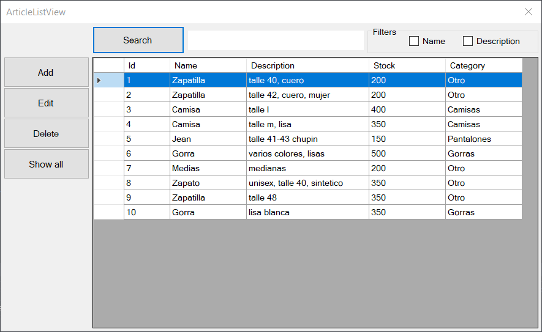

# Crud MVP WinForms

Sistema básico con operaciones CRUD hecha en .Net Framework 4.5 y SQL Server.

## ¿De qué trata esta aplicación? 

Este proyecto consiste en una pequeña aplicación de escritorio para sistemas Windows. La 
cual permite el registro y actualización de Artículos y su agrupación por Categorías. Además
tiene una sección de reportes donde se pueden visualizar los datos de manera clara y exportarlos
a otros formatos.

## ¿Cómo ejecutar la aplicación?

Para poder ejecutar el programa se requiere tener instalado los siguientes componentes

* [Runtime de .Net Framework 4.5](https://www.microsoft.com/es-ar/download/details.aspx?id=42642)
* [SQL Server 2018/2019](https://www.microsoft.com/es-ar/download/details.aspx?id=101064)
* Microsoft SQL Server Management Studio (SSMS) *(opcional)*

Una vez instalados seguir los siguientes pasos para probar la aplicación.

1. Descargar la última versión del proyecto compilado [desde aquí]() y descomprimir
en algún directorio.
2. Abrir el script `db_squema_and_data.min.sql` desde SSMS y ejecutarlo
para crear la base de datos.
3. Abrir el archivo `crud-mvp-winforms.exe.config` y configurar la cadena de
conexión a para que apunte a su base de datos local.
4. Ejecutar el archivo `crud-mvp-winforms.exe` e interactuar, eso es todo.

**ADICIONAL**

*Si quiere probar la aplicación solamente sin tener que crear o configurar una
base de datos SQL Server puede descargar ~~[desde aquí]()~~ una versión portable
que usa SQLite.*

## Arquitectura de la aplicación

Esta aplicación cuenta con una estructura tipo Modelo-Vista-Presentador (MVP) 
en la cual los presentadores conectan los modelos a las vistas mediante 
los contratos correspondientes, en los presentadores se maneja toda la lógica
de aplicación. 
Ademá, la aplicación se encuentra separada en cinco capas (proyectos) para su mejor organización.
 
 - **EntityLayer**: La capa que contiene los modelos de datos.
 - **DataLayer**: Es la capa de acceso a datos, contiene los repositorios y la configuración
 de la conexión a la base de datos.
 - **BussinesLayer**: La capa que contiene los servicios de la aplicación. 
 - **PresentationLayer**: Capa de presentación, se encarga de mostrar las vistas
   e interactuar con los modelos. 
 - **TestLayer**: Es una capa adicional que contiene algunas pruebas relacionadas a la capa
 de *BussinesLayer*.

## Entorno de desarollo

Solamente a fines técnicos, listo las herramientas usadas a los largo del desarrollo.

* Visual Studio 2019  
  Extensiones:  
  * Diseñador de informes RDLC de Microsoft para Visual Studio v15.3.1
  * Git Diff Margin v3.12.1 (by Laurent Kempé)
* Sublime Text
* Greenshot (capturas de pantalla)

## Capturas

    

    

    

Validaciones

    

    

## Licencia
  GPL-3.0
